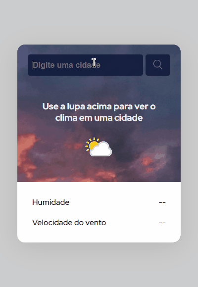

# Projeto de "Previsão do tempo" com API - </Dev em Dobro>

Um buscador simples de cidade. Que mostra tanto a temperatura em graus celcius, quanto valores de humidade e velocidade do vento, além de mudar o ícone do clima.

## Aprendizados

Esse projeto foi só seguir um vídeo. mas a intenção desde o começo, era apenas ter um primeiro contato com as API's. Assim eu pude ter uma base do que elas são e como eu usaria no meu futuro.

Um projeto simples, sem muitos aprendizados no HTML, CSS e JS

## Funcionalidades

- Pesquisa de cidades de todo o mundo com informações sobre o clima

## Demonstração

## Melhorias

Em algumas semanas, pretendo tornar a imagem de background dinamica, alterando-se conforme o clima da cidade e fazer com que o botão seja precionado com a tecla enter.

